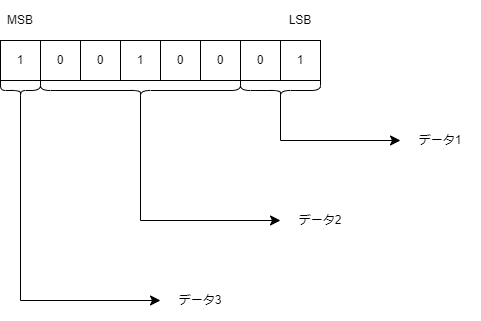
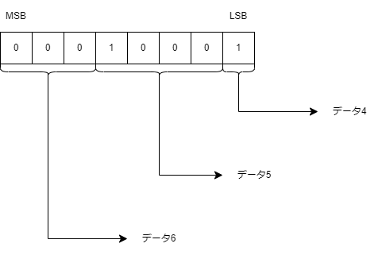
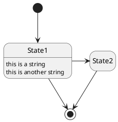
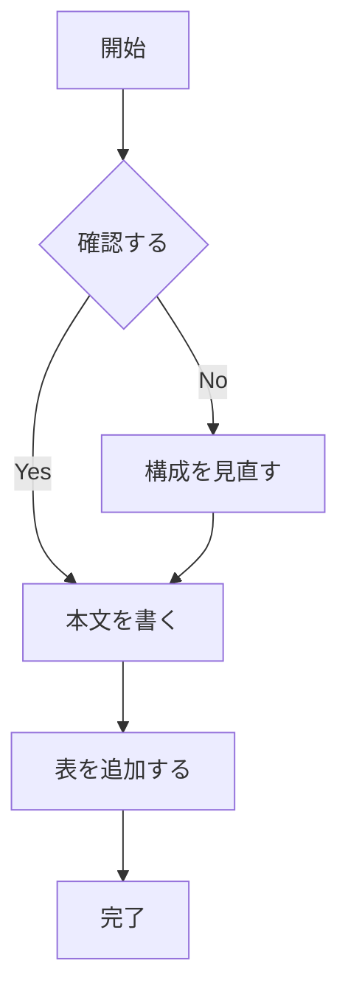
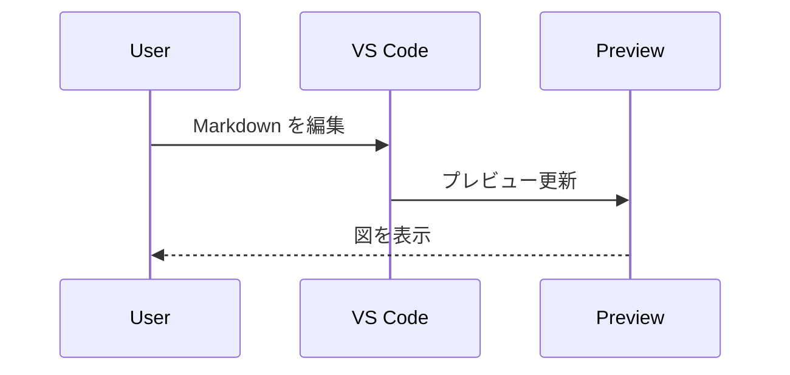

---
html:
  embed_local_images: true
  embed_svg: true
  offline: true
  toc: true
export_on_save:
  html: true
---

# template markdown

<!-- @import "[TOC]" {cmd="toc" depthFrom=1 depthTo=6 orderedList=false} -->

<!-- code_chunk_output -->

- [template markdown](#template-markdown)
  - [凡例](#凡例)
    - [スニペット呼び出し](#スニペット呼び出し)
  - [章立て](#章立て)
    - [章立て2](#章立て2)
      - [項](#項)
  - [画像](#画像)
    - [画像2](#画像2)
    - [画像3](#画像3)
    - [PlantUML](#plantuml)
    - [Mermaid](#mermaid)
    - [Table](#table)

<!-- /code_chunk_output -->

## 凡例

本書内での記述例を示す。

:::tip
補足的な小技や、知っていると作業しやすくなる内容を書く。
:::

:::info
前提知識、仕様、背景などの共有情報を書く。
:::

:::note
補足メモ、あとで見返したい気付き、雑多な記録を書く。
:::

:::warning
誤ると大きな影響が出る注意点や、避けるべき操作を書く。
:::

:::caution
扱いに注意が必要な手順や、条件付きで使う内容を書く。
:::

:::sample
コマンド、設定例、コード片などの記述例を書く。
:::

:::result
コマンド実行結果、確認結果、出力例を書く。
:::

### スニペット呼び出し

この環境でよく使う prefix は以下。

| 用途 | prefix |
| --- | --- |
| Front Matter | mdfront |
| Tip | mdtip |
| Info | mdinfo |
| Note | mdnote |
| Warning | mdwarn |
| Caution | mdcaution |
| Sample | mdsample |
| Result | mdresult |
| Table | mdtable |
| Image | mdimg |
| PlantUML | mdpuml |
| Mermaid flowchart | mdmermaid |
| Mermaid sequence | mdseq |

## 章立て

markdownによる文書を作成したい場合は、この環境を利用する。  

- 推奨事項に追加してある拡張機能を有効化すること。
- 上記有効化してあれば、目次も自動更新される。

### 章立て2

#### 項

## 画像

{.image_w300}

### 画像2

pngとjpgが張り付けられることは確認した。

### 画像3

複数ページを作成しても、参照されるのはページ1のみ。

drawio側を更新してもmarkdown側には即反映ではない？  
⇒ プレビューに反映されないだけみたい。html出力には反映された。  
⇒⇒ MPEを利用しているなら右上から更新すればいい  

### PlantUML

---

### Mermaid

シーケンス図の例。

---

### Table

| No. |  タイトル |
| --- | --------: |
| 1   | サンプル1 |
| 2   | サンプル2 |
