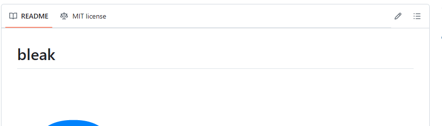

---
html:
  embed_local_images: true
  embed_svg: true
  offline: true
  toc: true
export_on_save:
  html: true
---

# template markdown

<!-- @import "[TOC]" {cmd="toc" depthFrom=1 depthTo=6 orderedList=false} -->

<!-- code_chunk_output -->

- [template markdown](#template-markdown)
  - [章立て](#章立て)
  - [章立て2](#章立て2)
    - [節](#節)
      - [項](#項)
  - [画像](#画像)
    - [画像2](#画像2)

<!-- /code_chunk_output -->

## 章立て

markdownによる文書を作成したい場合は、この環境を利用する。  

- 推奨事項に追加してある拡張機能を有効化すること。
- 上記有効化してあれば、目次も自動更新される。

## 章立て2

### 節

利用可能なnote記法は以下

:::note
note
aaa
:::

:::tip
note
aaa
:::

:::info
note
aaa
:::

:::warning
note
aaa
:::

:::caution
note
aaa
:::

:::sample
note
aaa
:::

#### 項

## 画像

### 画像2

